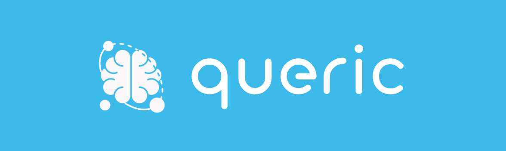

# Queric - Codex Application Backend



This is the backend for a NQL (Natural Query Language) framework application developed with NodeJS and Python. The Python scripts are located in the ai_modules directory and have their own requirements.

## Requirements

- NodeJS v14.14+
- Python
- MySQL database

## Installation

npm install vega-lite vega-cli canvas 


1. Clone the repository and navigate to the root directory.
2. Run `npm install` to install the required NodeJS dependencies.
3. Create a MySQL database using the `dump.sql` template provided.
4. Create a .env file in the root directory of the application with the following environment variables:
```DB_HOST=localhost
DB_USER=<your_mysql_username>
DB_PASS=<your_mysql_password>
DB_NAME=<your_mysql_database_name>
CODex_API_KEY=<your_codex_api_key>
```
5. Install the required Python libraries using `pip install -r requirements.txt`.
    Some requirements might be incoherent with running python version: in that case, install each requirement manually referring `to requirements.txt`. We suggest to use Python 3.10
6. Update the Python script configuration files located in the `ai_modules` directory with the appropriate API keys and credentials.
7. Start the backend server by running `node index.js`.

## Data flow


## Usage

The backend application serves as the REST API for the Codex NQL Framework. The API provides endpoints for storing, retrieving and querying metadata of a database schema. The AI modules in the `ai_modules` directory can be used to generate metadata using the NLP libraries of Python and the GPT-3.5-turbo codex model.

## License

This project is licensed under the MIT License - see the [LICENSE.md](LICENSE.md) file for details.

